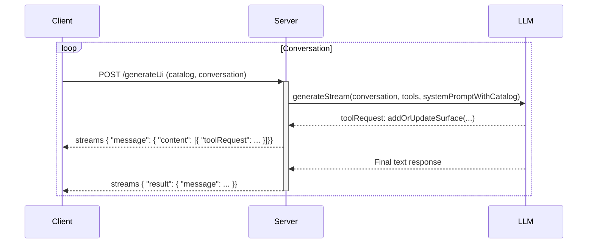

# Refactor: Stateless GenUI Server

## 1. Overview

This document outlines a refactoring of the GenUI client-server architecture to eliminate server-side state. The current implementation relies on a `startSession` flow where the client sends its component catalog once, and the server caches it for the duration of the session. This refactor proposes a stateless approach where the client sends the catalog with every request, removing the need for session management on the server.

## 2. Problem Analysis

The current stateful architecture presents several challenges:

- **Complexity**: The server needs to manage session state, including caching the component catalog for each active session. This adds complexity to the server-side logic and requires a persistence layer (Firestore in this case) to store session data.
- **Scalability**: Managing sessions can become a bottleneck in a highly concurrent environment. A stateless architecture is inherently more scalable, as any server instance can handle any request without needing access to session-specific data.
- **Brittleness**: If a session is lost on the server (e.g., due to a server restart or cache eviction), the client must re-establish the session. This can lead to a more fragile user experience.
- **Tight Coupling**: The client and server are tightly coupled through the session ID. The client must obtain a session ID and include it in all subsequent requests.

By making the server stateless, we can simplify the architecture, improve scalability, and create a more robust system.

## 3. Alternatives Considered

### Alternative 1: Keep the Stateful Architecture

We could continue with the current stateful design. However, this would mean accepting the complexity, scalability, and brittleness issues outlined above. For a system designed to be a general-purpose UI generation framework, a stateless architecture is a more robust and flexible choice.

### Alternative 2: Hybrid Approach

A hybrid approach could involve a short-lived cache for the catalog on the server. The client would send the catalog, and the server would cache it for a few minutes. If the catalog is not in the cache, the server would request it from the client. This would reduce the amount of data sent over the wire but would still require some level of session management and add complexity to the client-server interaction.

Given the goal of simplifying the architecture and improving scalability, a fully stateless approach is the most desirable option.

## 4. Detailed Design

The core of this refactor is to remove the `startSession` flow and modify the `generateUi` flow to accept the component catalog with each request.

### 4.1. Server-Side Changes (`genui_server`)

- **Remove `startSessionFlow`**: The `startSession` endpoint and its corresponding Genkit flow will be completely removed from the server.
- **Remove Session Caching**: The `cache.ts` file and all logic related to Firestore-based session caching will be removed. The server will no longer have any dependency on Firestore.
- **Update `generateUiFlow`**: The `generateUi` flow will be modified to accept the component catalog directly in the request body. The `sessionId` will be removed from the request.

The new request schema for `generateUi` will be:

```typescript
// In src/schemas.ts
export const generateUiRequestSchema = z.object({
  catalog: jsonSchema,
  conversation: z.array(messageSchema),
});
```

The `generateUiFlow` will be updated to use the catalog from the request instead of fetching it from the cache.

### 4.2. Client-Side Changes (`genui_client`)

- **Remove `startSession`**: The `startSession` method will be removed from `GenUIClient` and `UiAgent`.
- **Update `generateUI`**: The `generateUI` method in `GenUIClient` will be modified to send the catalog with each request. The `sessionId` parameter will be removed.
- **Update `UiAgent`**: The `UiAgent` will be updated to reflect the changes in `GenUIClient`. The `startSession` method will be removed, and the `sendRequest` and `sendUiEvents` methods will be updated to pass the catalog to the `generateUI` method.

### 4.3. Data Flow Diagram

The following Mermaid diagram illustrates the new, stateless data flow:



## 5. Summary of the Design

This refactor simplifies the GenUI architecture by moving to a stateless server model. By removing the `startSession` flow and session caching, we reduce complexity, improve scalability, and create a more robust system. The client will now send the component catalog with every request, making each `generateUi` call self-contained and independent of any server-side state.

## 6. References

- [Stateless vs. Stateful Architecture](https://aws.amazon.com/blogs/networking-and-content-delivery/stateless-vs-stateful-architectures-which-is-right-for-your-application/)
- [Genkit Documentation](https://genkit.dev/docs)