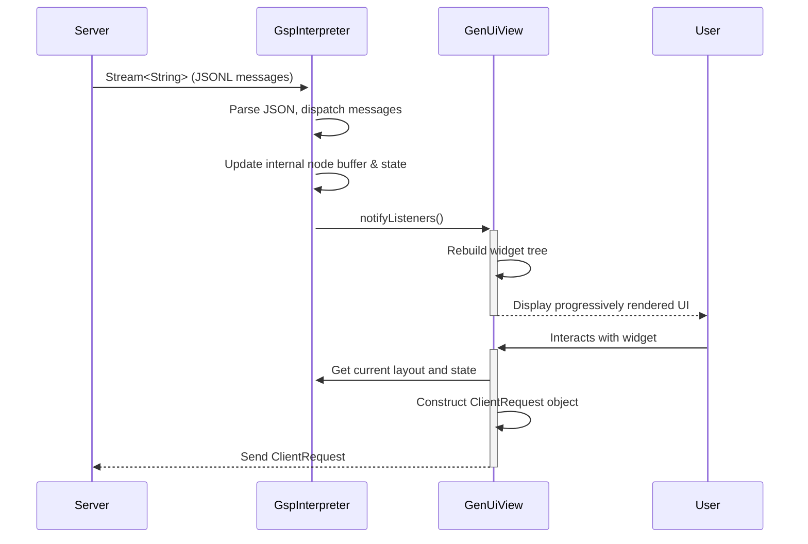
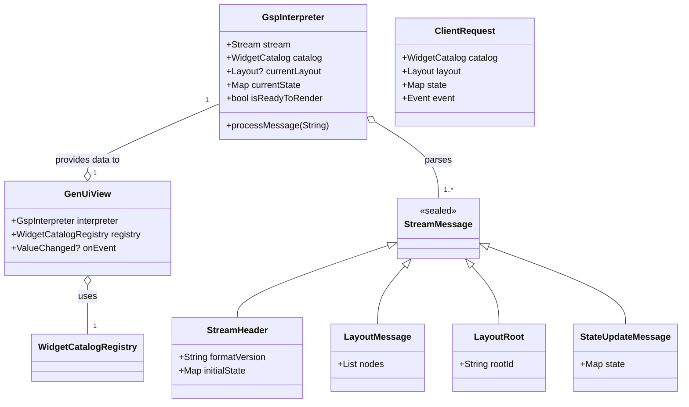

# Refactor Design: FCP Client Streaming Protocol Migration

## 1. Overview

This document outlines the design for refactoring the `fcp_client` package. The current implementation relies on a single, static `DynamicUIPacket` to render a UI, which is delivered all at once. The goal of this refactor is to align the client with the **GenUI Streaming Protocol (GSP)**, transitioning to a model where the UI is progressively rendered from a stream of JSON Lines (JSONL) messages.

This change will enable dynamic, real-time UI construction as data arrives from the server, and it will standardize the client-server communication for events. This refactor will focus on implementing the core streaming and full update capabilities, deferring the delta update mechanisms described in Appendix A of the protocol specification.

## 2. Problem Analysis

The current architecture has several limitations that the GSP is designed to address:

1.  **No Progressive Rendering**: The UI is built from a single, complete `DynamicUIPacket`. The entire UI definition must be received before any rendering can begin, which is inefficient for complex or slow-to-generate UIs.
2.  **Ad-hoc Update Mechanism**: The existing `FcpViewController` uses custom `StateUpdate` and `LayoutUpdate` models that are not compliant with the GSP specification.
3.  **Non-Standard Event Payloads**: The `EventPayload` model is simple but does not include the full context (catalog, layout, state) required by the GSP for server-side processing.
4.  **Tight Coupling**: The `FcpView` is tightly coupled to the `DynamicUIPacket` structure, making it inflexible to other forms of UI definition.

The GSP addresses these issues by introducing a JSONL stream that decouples different parts of the UI definition (`StreamHeader`, `Layout`, `LayoutRoot`, `StateUpdate`) and a standardized `ClientRequest` message for all client-to-server communication.

## 3. Alternatives Considered

### Alternative 1: Modify `FcpView` to Directly Consume a Stream

This approach would involve changing the `FcpView` widget to accept a `Stream<String>` of JSONL messages directly.

- **Pros**: Keeps the API surface area small, with a single primary widget.
- **Cons**: This would overload the `FcpView` with responsibilities beyond rendering. It would need to manage stream parsing, message dispatching, buffering layout nodes, and state management, making it a complex and difficult-to-maintain "god object". This violates the single responsibility principle.

### Alternative 2: Introduce a Dedicated GSP Interpreter (Chosen Approach)

This approach introduces a new class, `GspInterpreter`, to act as an intermediary between the raw data stream and the UI.

- **Pros**:
  - **Separation of Concerns**: The `GspInterpreter` handles all protocol-specific logic (parsing, buffering, state management), leaving the `FcpView` to focus solely on building the widget tree from a ready-to-render layout. This aligns perfectly with the "Client-Side Interpreter" concept described in the GSP document.
  - **Testability**: The interpreter can be unit-tested independently of the Flutter widget framework.
  - **Clarity and Maintainability**: The code is cleaner and more organized, making it easier to understand and modify in the future.
- **Cons**: Introduces one new class to the public API.

The second alternative is strongly preferred as it leads to a more robust, scalable, and maintainable architecture that directly reflects the design principles outlined in the GSP specification.

## 4. Detailed Design

The refactor will be centered around the new `GspInterpreter` and the modification of `FcpView` to use it.

### 4.1. New Data Models

A new file, `lib/src/models/streaming_models.dart`, will be created to house Dart `extension type` representations of all messages in the GSP JSONL stream and the `ClientRequest` message. This ensures type safety and aligns with the existing model architecture.

- `StreamMessage`: A sealed base class for all incoming messages.
- `StreamHeader`: Contains `formatVersion` and `initialState`.
- `Layout`: Contains a list of `LayoutNode` objects.
- `LayoutRoot`: Contains the `rootId`.
- `StateUpdate`: Contains a partial `state` object for updates.
- `ClientRequest`: The unified message for client-to-server communication, containing catalog info, an optional `Event`, and the current `layout` and `state`.
- `Event`: The standardized event object with `sourceNodeId`, `eventName`, `timestamp`, and `arguments`.
- `UnknownCatalogError`: The error message for catalog negotiation.

The existing `LayoutNode`, `WidgetCatalog`, and `WidgetDefinition` models will be reused, but models like `DynamicUIPacket`, the old `StateUpdate`, and `LayoutUpdate` will be removed. The `$bind` property will be moved from a separate `bindings` map to be inline inside of the `properties` map, as described in the specification.

### 4.2. The `GspInterpreter`

This new class will be the core of the client-side protocol implementation.

```dart
class GspInterpreter with ChangeNotifier {
  /// Input stream of raw JSONL strings from the server.
  final Stream<String> stream;

  /// The complete widget catalog for the application.
  final WidgetCatalog catalog;

  // Internal State
  Map<String, LayoutNode> _nodeBuffer = {};
  Map<String, Object?> _state = {};
  String? _rootId;
  bool _isReadyToRender = false;

  // Public Outputs
  Layout? get currentLayout;
  Map<String, Object?> get currentState => _state;
  bool get isReadyToRender => _isReadyToRender;

  GspInterpreter({required this.stream, required this.catalog}) {
    // Constructor starts listening to the stream and processing messages.
  }

  void processMessage(String jsonlMessage);
}
```

**Responsibilities:**

1.  **Listen to the Stream**: It will listen to the input `Stream<String>`.
2.  **Parse and Dispatch**: Each string is parsed from JSON into a `StreamMessage` subclass. A `switch` statement will dispatch the message to a handler (e.g., `_handleStreamHeader`, `_handleLayout`).
3.  **Manage State**:
    - `_handleStreamHeader`: Initializes the `_state` map from `initialState`.
    - `_handleLayout`: Adds the received `LayoutNode`s to the `_nodeBuffer`.
    - `_handleLayoutRoot`: Sets the `_rootId` and flips `_isReadyToRender` to `true` if the root node is in the buffer.
    - `_handleStateUpdate`: Merges the new state data into the main `_state` map.
4.  **Notify Listeners**: After processing any message that changes the UI (new nodes, new root, state update), it will call `notifyListeners()` to signal to `FcpView` that it needs to rebuild.

### 4.3. Refactored `GenUiView`

The `GenUiView` widget will be simplified significantly.

```dart
class GenUiView extends StatefulWidget {
  final GspInterpreter interpreter;
  final WidgetCatalogRegistry registry;
  final ValueChanged<ClientRequest>? onEvent;

  // ... constructor ...
}

class _GenUiViewState extends State<GenUiView> {
  @override
  void initState() {
    super.initState();
    widget.interpreter.addListener(_rebuild);
  }

  void _rebuild() {
    setState(() {});
  }

  // ... didUpdateWidget and dispose ...

  @override
  Widget build(BuildContext context) {
    if (!widget.interpreter.isReadyToRender) {
      return CircularProgressIndicator(); // Or other placeholder
    }
    // The build logic now gets the layout directly from the interpreter.
    // ... build the tree using _LayoutEngine ...
  }
}
```

- It will now take a `GspInterpreter` instance instead of a `DynamicUIPacket`.
- It will listen to the interpreter and call `setState` to trigger a rebuild whenever the UI changes.
- The `onEvent` callback will be updated to expect a fully formed `ClientRequest` object, which it can then serialize and send to the server.

### 4.4. Event Handling Flow

1.  A widget builder (e.g., for `ElevatedButton`) fires an event with a simple `EventPayload`.
2.  The `onEvent` callback in `GenUiView` is triggered.
3.  `GenUiView` constructs the full `ClientRequest` object by fetching the `currentLayout` and `currentState` from its `GspInterpreter`, and combining it with the catalog and the event payload.
4.  `GenUiView` invokes its `onEvent` callback, passing the complete `ClientRequest` object up to the application code, which is responsible for sending it to the server.

### 4.5. Diagrams

#### Data Flow Diagram



#### Class Diagram



## 5. Summary of Design

This refactor replaces the static `DynamicUIPacket` model with a streaming architecture centered around a new `GspInterpreter` class.

- **Input**: The client's primary input will be a `Stream<String>` of JSONL messages.
- **Processing**: The `GspInterpreter` will consume the stream, manage state, and buffer layout nodes.
- **Rendering**: The `GenUiView` will listen to the interpreter and progressively render the UI as it becomes available.
- **Events**: User interactions will trigger the creation of a standardized `ClientRequest` message, containing the full UI context, to be sent to the server.
- **Models**: New type-safe Dart models will be created for all GSP messages.

This design creates a clean separation of concerns, improves performance through progressive rendering, and strictly adheres to the GenUI Streaming Protocol specification.

## 6. References

- [GenUI Streaming Protocol Specification](packages/spikes/fcp_client/docs/GenUI_Streaming_Protocol.md)
