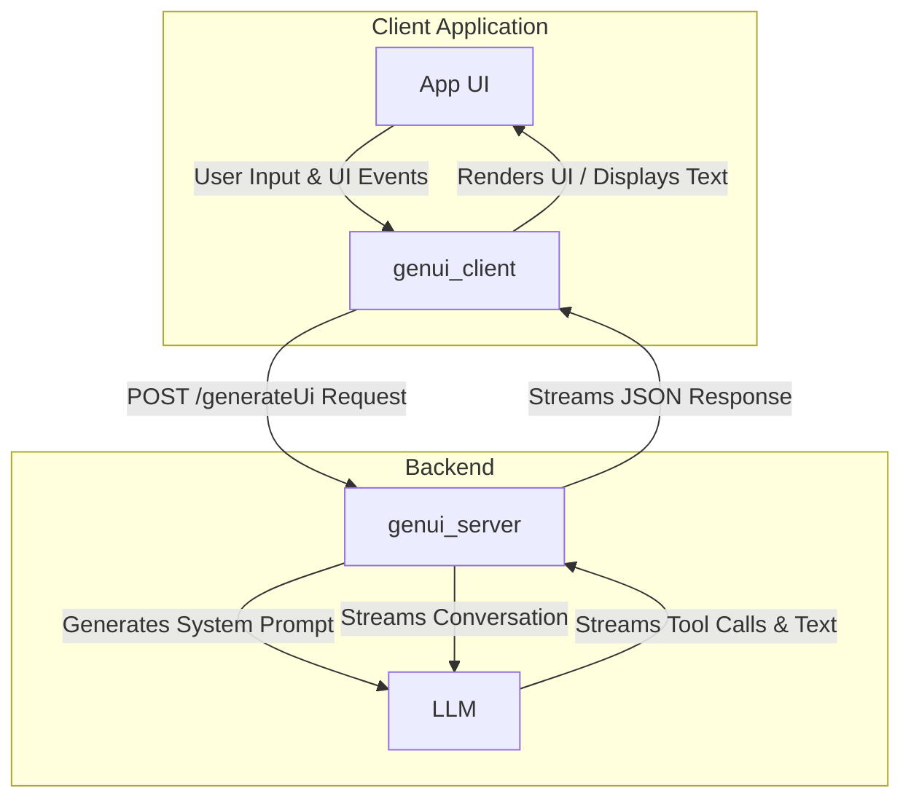

# GenUI Client-Server Communication Protocol

This document outlines the JSON-based wire format used for communication between a `genui_client` and a `genui_server`. The protocol is designed to facilitate real-time, AI-driven user interface generation over a streaming HTTP connection.

## Architecture Overview

The communication model involves a client application, a server that orchestrates AI interactions, and a Large Language Model (LLM) that generates UI definitions and text responses.



## Communication Flow

The interaction is stateful on the client and stateless on the server. The client maintains the full conversation history and sends it with every request. The server processes the request, interacts with the LLM, and streams back responses.

```mermaid
sequenceDiagram
    participant Client
    participant Server
    participant LLM

    Client->>+Server: POST /generateUi (catalog, conversation)
    Server->>Server: Prepare System Prompt with Catalog Schema
    Server->>+LLM: generateStream(prompt, conversation, tools)

    Note over LLM: LLM generates UI via tool calls.
    LLM-->>Server: toolRequest: addOrUpdateSurface(...)
    Server-->>-Client: streams chunk: { "message": { "content": [{ "toolRequest": ... }]}}

    Note over Client: Client processes toolRequest and updates UI in real-time.

    LLM-->>Server: (more tool requests can be streamed)
    Server-->>-Client: (more chunks are sent)

    LLM-->>Server: Final text response
    Server-->>-Client: streams final chunk: { "result": { "message": ... }}

    Note over Client: User interacts with the new UI.
    Client->>Client: User interaction creates a UiEvent.
    Client->>+Server: POST /generateUi (catalog, updated conversation with UiEvent)
    Note over Server, LLM: The cycle repeats.
```

## Endpoint: `POST /generateUi`

This is the sole endpoint for all communication. It operates in a streaming fashion to provide real-time UI updates.

- **URL**: `/generateUi`
- **Method**: `POST`
- **Query Parameters**:
  - `stream=true`: (Required) Indicates that the client expects a streaming response.
- **Content-Type**: `application/json`

---

## Request Body Format

The body of the `POST` request is a JSON object containing the client's UI capabilities (the catalog) and the complete conversation history.

### Top-Level Request Schema

```json
{
  "$schema": "http://json-schema.org/draft-07/schema#",
  "type": "object",
  "properties": {
    "catalog": {
      "description": "A JSON schema describing all UI widgets the client can render.",
      "$ref": "#/definitions/JsonSchema"
    },
    "conversation": {
      "description": "An array of messages representing the conversation history.",
      "type": "array",
      "items": {
        "$ref": "#/definitions/ChatMessage"
      }
    }
  },
  "required": ["catalog", "conversation"],
  "definitions": {
    "JsonSchema": {
      "type": "object",
      "properties": {
        "description": { "type": "string" },
        "type": { "type": "string" },
        "properties": { "type": "object" },
        "required": { "type": "array", "items": { "type": "string" } },
        "items": { "$ref": "#/definitions/JsonSchema" },
        "anyOf": { "type": "array", "items": { "$ref": "#/definitions/JsonSchema" } }
      }
    },
    "ChatMessage": {
      "type": "object",
      "properties": {
        "role": {
          "type": "string",
          "enum": ["user", "model"]
        },
        "parts": {
          "type": "array",
          "items": {
            "$ref": "#/definitions/MessagePart"
          }
        }
      },
      "required": ["role", "parts"]
    },
    "MessagePart": {
      "oneOf": [
        { "$ref": "#/definitions/TextPart" },
        { "$ref": "#/definitions/ImagePart" },
        { "$ref": "#/definitions/UiPart" },
        { "$ref": "#/definitions/UiEventPart" }
      ]
    },
    "TextPart": {
      "type": "object",
      "properties": {
        "type": { "const": "text" },
        "text": { "type": "string" }
      },
      "required": ["type", "text"]
    },
    "ImagePart": {
      "type": "object",
      "properties": {
        "type": { "const": "image" },
        "base64": { "type": "string" },
        "mimeType": { "type": "string" },
        "url": { "type": "string", "format": "uri" }
      },
      "required": ["type"]
    },
    "UiPart": {
      "type": "object",
      "properties": {
        "type": { "const": "ui" },
        "definition": { "$ref": "#/definitions/UiDefinition" }
      },
      "required": ["type", "definition"]
    },
    "UiEventPart": {
      "type": "object",
      "properties": {
        "type": { "const": "uiEvent" },
        "event": { "$ref": "#/definitions/UiEvent" }
      },
      "required": ["type", "event"]
    },
    "UiEvent": {
      "type": "object",
      "properties": {
        "surfaceId": { "type": "string" },
        "widgetId": { "type": "string" },
        "eventType": { "type": "string" },
        "isAction": { "type": "boolean" },
        "value": {{}},
        "timestamp": { "type": "string", "format": "date-time" }
      },
      "required": ["surfaceId", "widgetId", "eventType", "isAction", "timestamp"]
    },
    "UiDefinition": {
      "type": "object",
      "properties": {
        "surfaceId": { "type": "string" },
        "root": { "type": "string" },
        "widgets": {
          "type": "array",
          "items": { "type": "object" }
        }
      },
      "required": ["surfaceId", "root", "widgets"]
    }
  }
}
```

---

## Response Body Format

The server sends a stream of newline-delimited JSON objects. Clients should read the stream, split it by `\n`, and parse each non-empty line as a separate JSON object. Some chunks may be prefixed with `data:`, which should be stripped before parsing.

### Streaming Chunk (Tool Call)

While the LLM is processing, it may decide to call a tool to update the UI. Each tool call is sent as a JSON object in the stream.

**Schema:**

```json
{
  "$schema": "http://json-schema.org/draft-07/schema#",
  "type": "object",
  "properties": {
    "message": {
      "type": "object",
      "properties": {
        "role": { "const": "model" },
        "content": {
          "type": "array",
          "items": {
            "type": "object",
            "properties": {
              "toolRequest": {
                "type": "object",
                "properties": {
                  "name": { "type": "string", "enum": ["addOrUpdateSurface", "deleteSurface"] },
                  "input": { "type": "object" }
                },
                "required": ["name", "input"]
              }
            },
            "required": ["toolRequest"]
          }
        }
      },
      "required": ["role", "content"]
    }
  },
  "required": ["message"]
}
```

### Final Message Chunk

Once the LLM has finished generating tool calls and has a final text response for the user, it sends a final message object.

**Schema:**

```json
{
  "$schema": "http://json-schema.org/draft-07/schema#",
  "type": "object",
  "properties": {
    "result": {
      "type": "object",
      "properties": {
        "message": {
          "type": "object",
          "properties": {
            "role": { "const": "model" },
            "content": {
              "type": "array",
              "items": {
                "type": "object",
                "properties": {
                  "text": { "type": "string" }
                },
                "required": ["text"]
              }
            }
          },
          "required": ["role", "content"]
        }
      },
      "required": ["message"]
    }
  },
  "required": ["result"]
}
```

---

## Tool Definitions

The server exposes tools that the LLM can call. The `input` of the `toolRequest` chunk will conform to the schema of one of these tools.

### `addOrUpdateSurface`

Adds a new UI surface or updates an existing one.

**Input Schema:**

```json
{
  "$schema": "http://json-schema.org/draft-07/schema#",
  "type": "object",
  "properties": {
    "surfaceId": {
      "type": "string",
      "description": "The unique ID for the UI surface."
    },
    "definition": {
      "description": "A JSON object that defines the UI surface. This must conform to the client's catalog schema.",
      "$ref": "#/definitions/UiDefinition"
    }
  },
  "required": ["surfaceId", "definition"],
  "definitions": {
    "UiDefinition": {
      "type": "object",
      "properties": {
        "root": {
          "type": "string",
          "description": "The ID of the root widget in the UI tree."
        },
        "widgets": {
          "type": "array",
          "description": "A list of all the widget definitions for this UI surface.",
          "items": {
            "type": "object",
            "properties": {
              "id": { "type": "string", "description": "The unique ID for the widget." },
              "widget": { "type": "object", "description": "The widget definition." }
            },
            "required": ["id", "widget"]
          }
        }
      },
      "required": ["root", "widgets"]
    }
  }
}
```

### `deleteSurface`

Deletes a UI surface.

**Input Schema:**

```json
{
  "$schema": "http://json-schema.org/draft-07/schema#",
  "type": "object",
  "properties": {
    "surfaceId": {
      "type": "string",
      "description": "The unique ID for the UI surface to delete."
    }
  },
  "required": ["surfaceId"]
}
```
